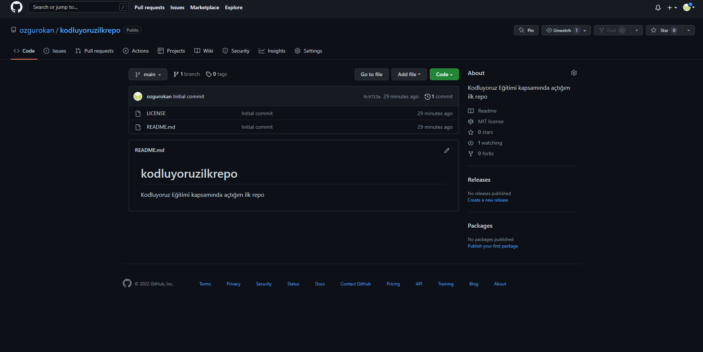

# Kodluyoruz Ilk Repo

Bu repo [Kodluyoruz](www.kodluyoruz.com) Front-End Eğitiminde oluşturduğum ilk repo. İçerisinde bir adet README dosyası, bir adet index.html dosyası barındırıyor



## Installation
Öncelikle projeyi clonlayın.

```
git clone "https://github.com/ozgurokan/kodluyoruzilkrepo.git"
``` 

## Usage
Clonlama işlemini tamamladıktan sonra Visual Studio Code programında açınız.

### Linux İçin:

``` 
cd kodluyoruzilkrepo 
code .
```

## Contributing
Pull requestler kabul edilir. Büyük değişiklikler için, lütfen önce neyi değiştirmek istediğinizi tartışmak için bir konu açınız.


## Licance
[MIT](LICENSE) License 

## Patika.dev
[www.patika.dev](www.patika.dev)